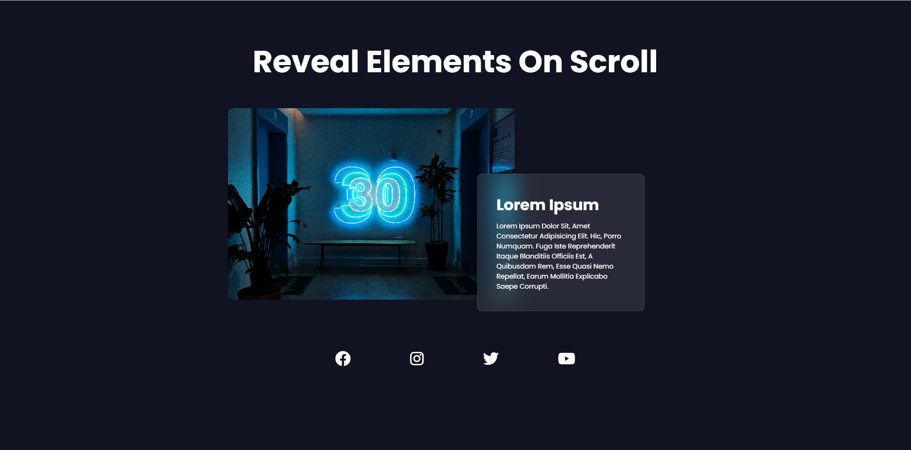

# ScrollReveal Animation Project
# Dome 
[Go To Demo](https://mohammedelsisi21.github.io/Project_Scroll_Reveal/)

# Description
> This project utilizes the ScrollReveal.js library to create smooth and engaging scroll animations across different sections of a webpage.
> The design is fully responsive, ensuring a seamless experience on both desktop and mobile devices.

## Features
- **Responsive Design**: The layout adapts to different screen sizes using media queries, ensuring content is displayed beautifully on all devices.
- **Smooth Animations**: Scroll animations are applied to various elements, including titles, images, and text blocks, to enhance the user experience.
- **Customizable Effects**: The ScrollReveal settings are fine-tuned to provide a balance between speed and visual appeal, with options for adjusting delay, duration, and origin of the animations.

This setup is ideal for creating visually appealing and interactive websites with minimal effort.

# Project ScreenShot
